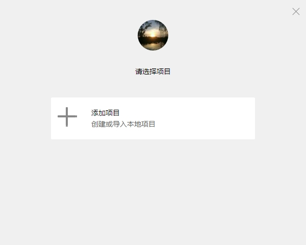
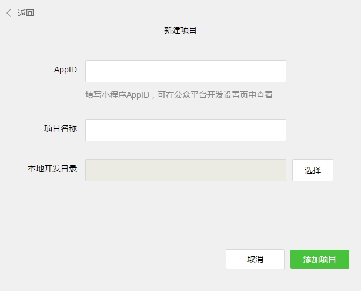
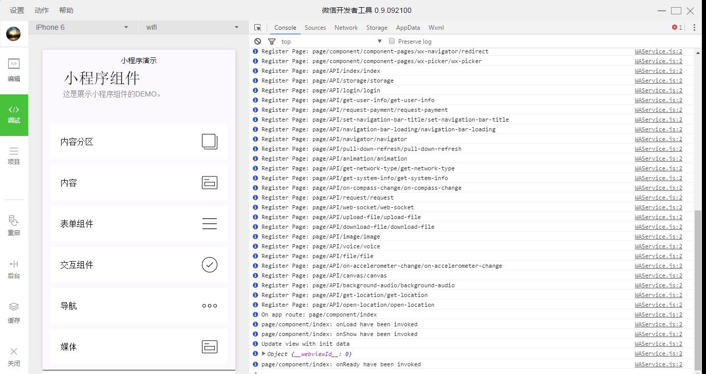

微信小程序（应用号）开发
==

[微信公众平台 · 小程序文档](https://github.com/venshine/wechat-lightapp/wiki)

大纲
--

* [官方资源](https://github.com/venshine/wechat-lightapp#官方资源)
* [~~下载资源~~](https://github.com/venshine/wechat-lightapp#下载资源)
* [~~破解说明~~](https://github.com/venshine/wechat-lightapp#破解说明)
* [新建项目](https://github.com/venshine/wechat-lightapp#新建项目)
* [开发文档](https://github.com/venshine/wechat-lightapp#开发文档官方)
* [学习教程](https://github.com/venshine/wechat-lightapp#学习教程)

## 官方资源
* [官方文档](https://mp.weixin.qq.com/debug/wxadoc/dev/?t=1474643026176)
* [开发工具](https://mp.weixin.qq.com/debug/wxadoc/dev/devtools/download.html?t=1474644089359)

## ~~下载资源~~
* 开发工具【Windows/Mac】
	* Github：[https://github.com/venshine/wechat-lightapp/tree/master/ide](https://github.com/venshine/wechat-lightapp/tree/master/ide)
	* 百度：[https://pan.baidu.com/s/1o7BVBQU](https://pan.baidu.com/s/1o7BVBQU) （密码: e5m1）
* 破解文件
    * Github：[https://github.com/venshine/wechat-lightapp/tree/master/crack](https://github.com/venshine/wechat-lightapp/tree/master/crack)
    * 百度：[https://pan.baidu.com/s/1gfPruMn](https://pan.baidu.com/s/1gfPruMn) （密码: jkc1）
* Demo
    * Github：[https://github.com/venshine/wechat-lightapp/tree/master/demo](https://github.com/venshine/wechat-lightapp/tree/master/demo)
    * 百度：[https://pan.baidu.com/s/1miJb2RY](https://pan.baidu.com/s/1miJb2RY) （密码: rhwc）

## ~~破解说明~~
1. 安装开发工具
2. 进入安装目录，替换破解文件
    * Windows
        * 安装目录\package.nw\app\dist\components\create\createstep.js
        * 安装目录\package.nw\app\dist\stroes\projectStores.js
    * Mac
        * 安装目录/Resources/app.nw/app/dist/components/create/createstep.js
        * 安装目录/Resources/app.nw/app/dist/stroes/projectStores.js  
3. 扫码登录

## 新建项目

* AppID：随意
* 项目名称：随意
* 本地开发目录：选择一个目录（注：可以选择demo目录）

点击添加项目即可完成新建项目，下图是运行demo程序的界面。

## 开发文档【官方】
* [简易教程](https://mp.weixin.qq.com/debug/wxadoc/dev/?t=1474644083132)
* [框架](https://mp.weixin.qq.com/debug/wxadoc/dev/framework/MINA.html?t=1474643026176)
* [组件](https://mp.weixin.qq.com/debug/wxadoc/dev/component/?t=1474644089682)
* [API](https://mp.weixin.qq.com/debug/wxadoc/dev/api/?t=1474644087418)
* [工具](https://mp.weixin.qq.com/debug/wxadoc/dev/devtools/devtools.html?t=1474644084689)

## 学习教程
* [微信小程序「官方示例代码」浅析【上】](http://mp.weixin.qq.com/s?__biz=MjM5Mjg4NDMwMA==&mid=2652974082&idx=1&sn=47c7f672caf629cd846e315b8df2b1c5&scene=21#wechat_redirect)
* [微信小程序剖析【下】：运行机制](http://mp.weixin.qq.com/s?__biz=MjM5Mjg4NDMwMA==&mid=2652974093&idx=1&sn=0570a243304ea8bb7d1b636624886fb1&scene=21#wechat_redirect)
* [开发微信小程序的必备技能图谱](http://geek.csdn.net/news/detail/103138)
* [抢先看：微信官方发布的微信应用号（小程序）设计规范](http://www.woshipm.com/ucd/418190.html)
* [首个微信小程序开发教程](http://gold.xitu.io/entry/57e34d6bd2030900691e9ad7)
* [微信公众平台 |小程序 API文档](http://wxopen.notedown.cn/)
* [微信小程序开发教程！](https://xituqu.com/508.html)
* [微信小程序怎么开发？玩物志用一个上午上线了电商应用](http://www.ifanr.com/721124)
* [微信小程序，一个有局限的类似 React Native 轮子！](http://www.jianshu.com/p/060c6f3dd4e8)
* [全球首个微信应用号开发教程！通宵吐血赶稿，每日更新！](https://my.oschina.net/wwnick/blog/750055)

